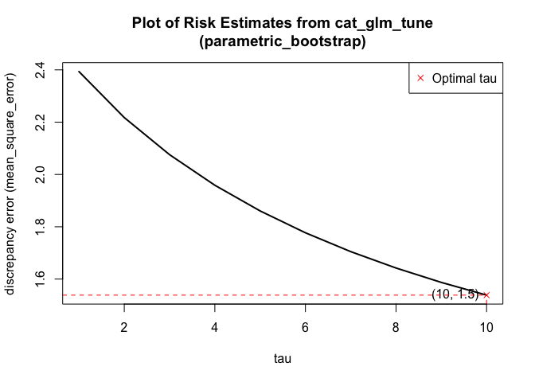
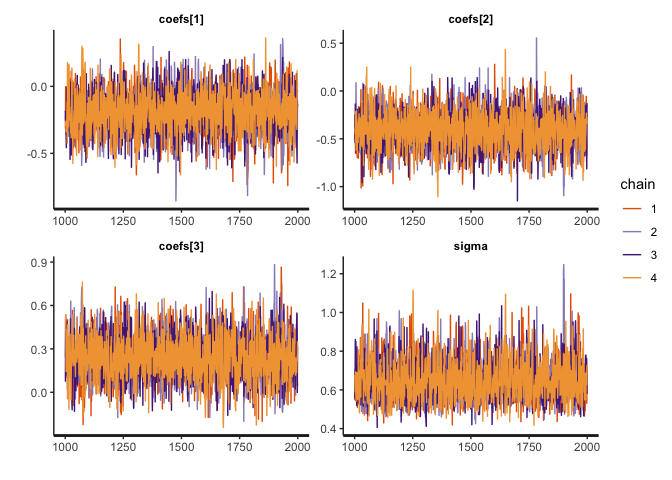
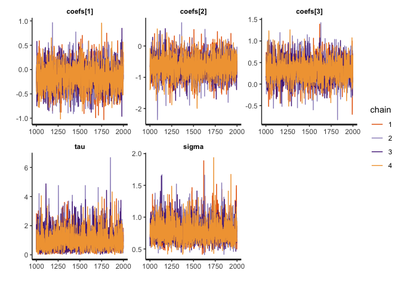

# catalytic

The `catalytic` package enhances the stability and accuracy of
Generalized Linear Models (GLMs) and Cox proportional hazards models
(COX) in `R`, especially in high-dimensional or sparse data settings
where traditional methods struggle. By employing catalytic prior
distributions, this package integrates observed data with synthetic data
generated from simpler models, effectively reducing issues like
overfitting. This approach provides more robust parameter estimation,
making `catalytic` a valuable tool for complex and limited-data
scenarios.

## Installation

You can install the released version of catalytic from
[CRAN](https://CRAN.R-project.org) with:

    install.packages("catalytic")

    ## Installing package into '/private/var/folders/j5/bktz8wt94hv7m_wtcc0k6ymh0000gn/T/RtmpNJNjW2/temp_libpath107b87e07f100'
    ## (as 'lib' is unspecified)

    ## Warning: package 'catalytic' is not available for this version of R
    ## 
    ## A version of this package for your version of R might be available elsewhere,
    ## see the ideas at
    ## https://cran.r-project.org/doc/manuals/r-patched/R-admin.html#Installing-packages

    library(catalytic)

## Example

    set.seed(1)

    data <- data.frame(
      X1 = stats::rnorm(10),
      X2 = stats::rnorm(10),
      Y = stats::rnorm(10)
    )

    # Step 1: Initialization
    cat_init <- cat_glm_initialization(
      formula = Y ~ 1, # Formula for a simple model to generate synthetic response
      family = gaussian,
      data = data,
      syn_size = 100 # Synthetic data size
    )
    print(cat_init)

    ## cat_glm_initialization
    ##  formula:               Y ~ 1
    ##  model:                 Unknown Variance
    ##  custom variance:       NULL
    ##  family:                gaussian [identity]
    ##  covariates dimention:  10 (Observation) + 100 (Synthetic) = 110 rows with 2 column(s)
    ## ------
    ## Observation Data Information:
    ##  covariates dimention:  10 rows with  2 column(s)
    ##  head(data) :              
    ##  [only show the head of first 10 columns] 
    ## 
    ##           X1          X2           Y
    ## 1 -0.6264538  1.51178117  0.91897737
    ## 2  0.1836433  0.38984324  0.78213630
    ## 3 -0.8356286 -0.62124058  0.07456498
    ## 4  1.5952808 -2.21469989 -1.98935170
    ## 5  0.3295078  1.12493092  0.61982575
    ## 6 -0.8204684 -0.04493361 -0.05612874
    ## 
    ## ------
    ## Synthetic Data Information:
    ##  covariates dimention:  100 rows with  2  column(s)
    ##  head(data):              
    ##  [only show the head of first 10 columns] 
    ## 
    ##           X1         X2          Y
    ## 1 -0.8356286  0.5953590 -0.1336732
    ## 2 -0.3053884  0.6855034 -0.1336732
    ## 3 -0.8204684  0.3898432 -0.1336732
    ## 4  0.7383247  0.5939013 -0.1336732
    ## 5  0.1836433  0.7523157 -0.1336732
    ## 6  0.1836433 -0.7461351 -0.1336732
    ## 
    ##  data generation process:
    ##  [only show the first 10 columns] 
    ## 
    ##                Covariate                   Type                Process
    ## 1 X1                     Continuous             Coordinate            
    ## 2 X2                     Continuous             Coordinate->Deskewing 
    ## 
    ## ------
    ## * For help interpreting the printed output see ?print.cat_initialization

    # Step 2: Choose Method(s)
    ## Method 1 - Estimation with fixed tau
    cat_glm_model <- cat_glm(
      formula = Y ~ ., # Formula for model fitting
      cat_init = cat_init, # Output object from `cat_glm_initialization`
      tau = 10 # Down-weight factor for synthetic data
    )
    print(cat_glm_model)

    ## cat_glm
    ##  formula:                Y ~ .
    ##  covariates dimention:   10 (Observation) + 100 (Synthetic) = 110 rows with 2 column(s)
    ##  tau:                    10
    ##  family:                 gaussian [identity]
    ## ------
    ## coefficients' information:
    ## (Intercept)          X1          X2 
    ##      -0.199      -0.402       0.250 
    ## 
    ## ------
    ## * For help interpreting the printed output see ?print.cat

    print(predict(cat_glm_model))

    ##           1           2           3           4           5           6 
    ##  0.43141012 -0.17506574 -0.01774890 -1.39427971 -0.04996112  0.12024636 
    ##           7           8           9          10 
    ## -0.39882013 -0.25973457 -0.22499036  0.07272498

    ## Method 2 - Estimation with selective tau
    cat_glm_tune_model <- cat_glm_tune(
      formula = Y ~ .,
      cat_init = cat_init,
      tau_seq = seq(1, 10) # Vector of values for downweighting synthetic data
    )
    print(cat_glm_tune_model)

    ## cat_glm_tune
    ##  formula:                 Y ~ .
    ##  covariates dimention:    10 (Observation) + 100 (Synthetic) = 110 rows with 2 column(s)
    ##  tau sequnce:             1, 2, 3, 4, 5, 6, 7, 8, 9, 10
    ##  family:                  gaussian
    ##  risk estimate method:    parametric_bootstrap
    ##  discrepancy method:      mean_square_error
    ## 
    ##  optimal tau:             10
    ##  minimun risk estimate:   1.539
    ## ------
    ## coefficients' information:
    ## 
    ## (Intercept)          X1          X2 
    ##      -0.199      -0.402       0.250 
    ## 
    ## ------
    ## * For help interpreting the printed output see ?print.cat_tune

    print(predict(cat_glm_tune_model))

    ##           1           2           3           4           5           6 
    ##  0.43141012 -0.17506574 -0.01774890 -1.39427971 -0.04996112  0.12024636 
    ##           7           8           9          10 
    ## -0.39882013 -0.25973457 -0.22499036  0.07272498

    plot(cat_glm_tune_model, text_pos = 2)

    ## Method 3 - Bayesian posterior sampling with fixed tau
    cat_glm_bayes_model <- cat_glm_bayes(
      formula = Y ~ .,
      cat_init = cat_init,
      tau = 10
    )

    ## 
    ## SAMPLING FOR MODEL 'anon_model' NOW (CHAIN 1).
    ## Chain 1: 
    ## Chain 1: Gradient evaluation took 2.5e-05 seconds
    ## Chain 1: 1000 transitions using 10 leapfrog steps per transition would take 0.25 seconds.
    ## Chain 1: Adjust your expectations accordingly!
    ## Chain 1: 
    ## Chain 1: 
    ## Chain 1: Iteration:    1 / 2000 [  0%]  (Warmup)
    ## Chain 1: Iteration:  200 / 2000 [ 10%]  (Warmup)
    ## Chain 1: Iteration:  400 / 2000 [ 20%]  (Warmup)
    ## Chain 1: Iteration:  600 / 2000 [ 30%]  (Warmup)
    ## Chain 1: Iteration:  800 / 2000 [ 40%]  (Warmup)
    ## Chain 1: Iteration: 1000 / 2000 [ 50%]  (Warmup)
    ## Chain 1: Iteration: 1001 / 2000 [ 50%]  (Sampling)
    ## Chain 1: Iteration: 1200 / 2000 [ 60%]  (Sampling)
    ## Chain 1: Iteration: 1400 / 2000 [ 70%]  (Sampling)
    ## Chain 1: Iteration: 1600 / 2000 [ 80%]  (Sampling)
    ## Chain 1: Iteration: 1800 / 2000 [ 90%]  (Sampling)
    ## Chain 1: Iteration: 2000 / 2000 [100%]  (Sampling)
    ## Chain 1: 
    ## Chain 1:  Elapsed Time: 0.046 seconds (Warm-up)
    ## Chain 1:                0.045 seconds (Sampling)
    ## Chain 1:                0.091 seconds (Total)
    ## Chain 1: 
    ## 
    ## SAMPLING FOR MODEL 'anon_model' NOW (CHAIN 2).
    ## Chain 2: 
    ## Chain 2: Gradient evaluation took 7e-06 seconds
    ## Chain 2: 1000 transitions using 10 leapfrog steps per transition would take 0.07 seconds.
    ## Chain 2: Adjust your expectations accordingly!
    ## Chain 2: 
    ## Chain 2: 
    ## Chain 2: Iteration:    1 / 2000 [  0%]  (Warmup)
    ## Chain 2: Iteration:  200 / 2000 [ 10%]  (Warmup)
    ## Chain 2: Iteration:  400 / 2000 [ 20%]  (Warmup)
    ## Chain 2: Iteration:  600 / 2000 [ 30%]  (Warmup)
    ## Chain 2: Iteration:  800 / 2000 [ 40%]  (Warmup)
    ## Chain 2: Iteration: 1000 / 2000 [ 50%]  (Warmup)
    ## Chain 2: Iteration: 1001 / 2000 [ 50%]  (Sampling)
    ## Chain 2: Iteration: 1200 / 2000 [ 60%]  (Sampling)
    ## Chain 2: Iteration: 1400 / 2000 [ 70%]  (Sampling)
    ## Chain 2: Iteration: 1600 / 2000 [ 80%]  (Sampling)
    ## Chain 2: Iteration: 1800 / 2000 [ 90%]  (Sampling)
    ## Chain 2: Iteration: 2000 / 2000 [100%]  (Sampling)
    ## Chain 2: 
    ## Chain 2:  Elapsed Time: 0.046 seconds (Warm-up)
    ## Chain 2:                0.047 seconds (Sampling)
    ## Chain 2:                0.093 seconds (Total)
    ## Chain 2: 
    ## 
    ## SAMPLING FOR MODEL 'anon_model' NOW (CHAIN 3).
    ## Chain 3: 
    ## Chain 3: Gradient evaluation took 6e-06 seconds
    ## Chain 3: 1000 transitions using 10 leapfrog steps per transition would take 0.06 seconds.
    ## Chain 3: Adjust your expectations accordingly!
    ## Chain 3: 
    ## Chain 3: 
    ## Chain 3: Iteration:    1 / 2000 [  0%]  (Warmup)
    ## Chain 3: Iteration:  200 / 2000 [ 10%]  (Warmup)
    ## Chain 3: Iteration:  400 / 2000 [ 20%]  (Warmup)
    ## Chain 3: Iteration:  600 / 2000 [ 30%]  (Warmup)
    ## Chain 3: Iteration:  800 / 2000 [ 40%]  (Warmup)
    ## Chain 3: Iteration: 1000 / 2000 [ 50%]  (Warmup)
    ## Chain 3: Iteration: 1001 / 2000 [ 50%]  (Sampling)
    ## Chain 3: Iteration: 1200 / 2000 [ 60%]  (Sampling)
    ## Chain 3: Iteration: 1400 / 2000 [ 70%]  (Sampling)
    ## Chain 3: Iteration: 1600 / 2000 [ 80%]  (Sampling)
    ## Chain 3: Iteration: 1800 / 2000 [ 90%]  (Sampling)
    ## Chain 3: Iteration: 2000 / 2000 [100%]  (Sampling)
    ## Chain 3: 
    ## Chain 3:  Elapsed Time: 0.044 seconds (Warm-up)
    ## Chain 3:                0.048 seconds (Sampling)
    ## Chain 3:                0.092 seconds (Total)
    ## Chain 3: 
    ## 
    ## SAMPLING FOR MODEL 'anon_model' NOW (CHAIN 4).
    ## Chain 4: 
    ## Chain 4: Gradient evaluation took 7e-06 seconds
    ## Chain 4: 1000 transitions using 10 leapfrog steps per transition would take 0.07 seconds.
    ## Chain 4: Adjust your expectations accordingly!
    ## Chain 4: 
    ## Chain 4: 
    ## Chain 4: Iteration:    1 / 2000 [  0%]  (Warmup)
    ## Chain 4: Iteration:  200 / 2000 [ 10%]  (Warmup)
    ## Chain 4: Iteration:  400 / 2000 [ 20%]  (Warmup)
    ## Chain 4: Iteration:  600 / 2000 [ 30%]  (Warmup)
    ## Chain 4: Iteration:  800 / 2000 [ 40%]  (Warmup)
    ## Chain 4: Iteration: 1000 / 2000 [ 50%]  (Warmup)
    ## Chain 4: Iteration: 1001 / 2000 [ 50%]  (Sampling)
    ## Chain 4: Iteration: 1200 / 2000 [ 60%]  (Sampling)
    ## Chain 4: Iteration: 1400 / 2000 [ 70%]  (Sampling)
    ## Chain 4: Iteration: 1600 / 2000 [ 80%]  (Sampling)
    ## Chain 4: Iteration: 1800 / 2000 [ 90%]  (Sampling)
    ## Chain 4: Iteration: 2000 / 2000 [100%]  (Sampling)
    ## Chain 4: 
    ## Chain 4:  Elapsed Time: 0.045 seconds (Warm-up)
    ## Chain 4:                0.045 seconds (Sampling)
    ## Chain 4:                0.09 seconds (Total)
    ## Chain 4:

    print(cat_glm_bayes_model)

    ## cat_glm_bayes
    ##  formula:                Y ~ .
    ##  covariates dimention:   10 (Observation) + 100 (Synthetic) = 110 rows with 2 column(s)
    ##  tau:                    10
    ##  family:                 gaussian [identity]
    ##  stan algorithm:         NUTS
    ##  stan chain:             4
    ##  stan iter:              2000
    ##  stan warmup:            1000
    ## ------
    ## coefficients' information:
    ## 
    ##                mean se_mean    sd    2.5%     25%     50%     75%   97.5%
    ## (Intercept)  -0.196   0.003 0.156  -0.504  -0.298  -0.197  -0.093   0.118
    ## X1           -0.405   0.003 0.198  -0.813  -0.536  -0.405  -0.277  -0.017
    ## X2            0.247   0.003 0.153  -0.053   0.146   0.247   0.351   0.554
    ## sigma         0.648   0.002 0.103   0.483   0.575   0.636   0.703   0.888
    ## lp__        -18.429   0.039 1.550 -22.281 -19.198 -18.074 -17.319 -16.535
    ##                n_eff  Rhat
    ## (Intercept) 3547.056 1.003
    ## X1          3928.271 0.999
    ## X2          3583.399 1.001
    ## sigma       2780.931 1.000
    ## lp__        1547.193 1.000
    ## 
    ## ------
    ## * For help interpreting the printed output see ?print.cat_bayes

    print(predict(cat_glm_bayes_model))

    ##  [1]  0.43217093 -0.17392884 -0.01089480 -1.39082785 -0.05115094  0.12558130
    ##  [7] -0.39757973 -0.26171856 -0.22616132  0.07484400

    traceplot(cat_glm_bayes_model)

    ## Method 4 - Bayesian posterior sampling with adaptive tau
    cat_glm_bayes_joint_model <- cat_glm_bayes_joint(
      formula = Y ~ .,
      cat_init = cat_init
    )

    ## 
    ## SAMPLING FOR MODEL 'anon_model' NOW (CHAIN 1).
    ## Chain 1: 
    ## Chain 1: Gradient evaluation took 0.000251 seconds
    ## Chain 1: 1000 transitions using 10 leapfrog steps per transition would take 2.51 seconds.
    ## Chain 1: Adjust your expectations accordingly!
    ## Chain 1: 
    ## Chain 1: 
    ## Chain 1: Iteration:    1 / 2000 [  0%]  (Warmup)
    ## Chain 1: Iteration:  200 / 2000 [ 10%]  (Warmup)
    ## Chain 1: Iteration:  400 / 2000 [ 20%]  (Warmup)
    ## Chain 1: Iteration:  600 / 2000 [ 30%]  (Warmup)
    ## Chain 1: Iteration:  800 / 2000 [ 40%]  (Warmup)
    ## Chain 1: Iteration: 1000 / 2000 [ 50%]  (Warmup)
    ## Chain 1: Iteration: 1001 / 2000 [ 50%]  (Sampling)
    ## Chain 1: Iteration: 1200 / 2000 [ 60%]  (Sampling)
    ## Chain 1: Iteration: 1400 / 2000 [ 70%]  (Sampling)
    ## Chain 1: Iteration: 1600 / 2000 [ 80%]  (Sampling)
    ## Chain 1: Iteration: 1800 / 2000 [ 90%]  (Sampling)
    ## Chain 1: Iteration: 2000 / 2000 [100%]  (Sampling)
    ## Chain 1: 
    ## Chain 1:  Elapsed Time: 0.059 seconds (Warm-up)
    ## Chain 1:                0.057 seconds (Sampling)
    ## Chain 1:                0.116 seconds (Total)
    ## Chain 1: 
    ## 
    ## SAMPLING FOR MODEL 'anon_model' NOW (CHAIN 2).
    ## Chain 2: 
    ## Chain 2: Gradient evaluation took 8e-06 seconds
    ## Chain 2: 1000 transitions using 10 leapfrog steps per transition would take 0.08 seconds.
    ## Chain 2: Adjust your expectations accordingly!
    ## Chain 2: 
    ## Chain 2: 
    ## Chain 2: Iteration:    1 / 2000 [  0%]  (Warmup)
    ## Chain 2: Iteration:  200 / 2000 [ 10%]  (Warmup)
    ## Chain 2: Iteration:  400 / 2000 [ 20%]  (Warmup)
    ## Chain 2: Iteration:  600 / 2000 [ 30%]  (Warmup)
    ## Chain 2: Iteration:  800 / 2000 [ 40%]  (Warmup)
    ## Chain 2: Iteration: 1000 / 2000 [ 50%]  (Warmup)
    ## Chain 2: Iteration: 1001 / 2000 [ 50%]  (Sampling)
    ## Chain 2: Iteration: 1200 / 2000 [ 60%]  (Sampling)
    ## Chain 2: Iteration: 1400 / 2000 [ 70%]  (Sampling)
    ## Chain 2: Iteration: 1600 / 2000 [ 80%]  (Sampling)
    ## Chain 2: Iteration: 1800 / 2000 [ 90%]  (Sampling)
    ## Chain 2: Iteration: 2000 / 2000 [100%]  (Sampling)
    ## Chain 2: 
    ## Chain 2:  Elapsed Time: 0.055 seconds (Warm-up)
    ## Chain 2:                0.052 seconds (Sampling)
    ## Chain 2:                0.107 seconds (Total)
    ## Chain 2: 
    ## 
    ## SAMPLING FOR MODEL 'anon_model' NOW (CHAIN 3).
    ## Chain 3: 
    ## Chain 3: Gradient evaluation took 9e-06 seconds
    ## Chain 3: 1000 transitions using 10 leapfrog steps per transition would take 0.09 seconds.
    ## Chain 3: Adjust your expectations accordingly!
    ## Chain 3: 
    ## Chain 3: 
    ## Chain 3: Iteration:    1 / 2000 [  0%]  (Warmup)
    ## Chain 3: Iteration:  200 / 2000 [ 10%]  (Warmup)
    ## Chain 3: Iteration:  400 / 2000 [ 20%]  (Warmup)
    ## Chain 3: Iteration:  600 / 2000 [ 30%]  (Warmup)
    ## Chain 3: Iteration:  800 / 2000 [ 40%]  (Warmup)
    ## Chain 3: Iteration: 1000 / 2000 [ 50%]  (Warmup)
    ## Chain 3: Iteration: 1001 / 2000 [ 50%]  (Sampling)
    ## Chain 3: Iteration: 1200 / 2000 [ 60%]  (Sampling)
    ## Chain 3: Iteration: 1400 / 2000 [ 70%]  (Sampling)
    ## Chain 3: Iteration: 1600 / 2000 [ 80%]  (Sampling)
    ## Chain 3: Iteration: 1800 / 2000 [ 90%]  (Sampling)
    ## Chain 3: Iteration: 2000 / 2000 [100%]  (Sampling)
    ## Chain 3: 
    ## Chain 3:  Elapsed Time: 0.058 seconds (Warm-up)
    ## Chain 3:                0.057 seconds (Sampling)
    ## Chain 3:                0.115 seconds (Total)
    ## Chain 3: 
    ## 
    ## SAMPLING FOR MODEL 'anon_model' NOW (CHAIN 4).
    ## Chain 4: 
    ## Chain 4: Gradient evaluation took 9e-06 seconds
    ## Chain 4: 1000 transitions using 10 leapfrog steps per transition would take 0.09 seconds.
    ## Chain 4: Adjust your expectations accordingly!
    ## Chain 4: 
    ## Chain 4: 
    ## Chain 4: Iteration:    1 / 2000 [  0%]  (Warmup)
    ## Chain 4: Iteration:  200 / 2000 [ 10%]  (Warmup)
    ## Chain 4: Iteration:  400 / 2000 [ 20%]  (Warmup)
    ## Chain 4: Iteration:  600 / 2000 [ 30%]  (Warmup)
    ## Chain 4: Iteration:  800 / 2000 [ 40%]  (Warmup)
    ## Chain 4: Iteration: 1000 / 2000 [ 50%]  (Warmup)
    ## Chain 4: Iteration: 1001 / 2000 [ 50%]  (Sampling)
    ## Chain 4: Iteration: 1200 / 2000 [ 60%]  (Sampling)
    ## Chain 4: Iteration: 1400 / 2000 [ 70%]  (Sampling)
    ## Chain 4: Iteration: 1600 / 2000 [ 80%]  (Sampling)
    ## Chain 4: Iteration: 1800 / 2000 [ 90%]  (Sampling)
    ## Chain 4: Iteration: 2000 / 2000 [100%]  (Sampling)
    ## Chain 4: 
    ## Chain 4:  Elapsed Time: 0.059 seconds (Warm-up)
    ## Chain 4:                0.054 seconds (Sampling)
    ## Chain 4:                0.113 seconds (Total)
    ## Chain 4:

    print(cat_glm_bayes_joint_model)

    ## cat_glm_bayes_joint
    ##  formula:                Y ~ .
    ##  covariates dimention:   10 (Observation) + 100 (Synthetic) = 110 rows with 2 column(s)
    ##  family:                 gaussian [identity]
    ##  stan algorithm:         NUTS
    ##  stan chain:             4
    ##  stan iter:              2000
    ##  stan warmup:            1000
    ## ------
    ## coefficients' information:
    ## 
    ##                mean se_mean    sd    2.5%     25%     50%     75%   97.5%
    ## (Intercept)  -0.141   0.004 0.259  -0.658  -0.308  -0.141   0.028   0.385
    ## X1           -0.647   0.006 0.348  -1.331  -0.876  -0.647  -0.422   0.053
    ## X2            0.334   0.005 0.257  -0.179   0.171   0.335   0.497   0.864
    ## tau           0.963   0.011 0.684   0.122   0.470   0.798   1.310   2.623
    ## sigma         0.777   0.003 0.167   0.527   0.658   0.752   0.867   1.167
    ## lp__        -14.090   0.045 1.801 -18.409 -15.022 -13.716 -12.755 -11.682
    ##                n_eff  Rhat
    ## (Intercept) 3607.756 1.000
    ## X1          3361.235 1.000
    ## X2          3098.601 1.001
    ## tau         4149.713 1.001
    ## sigma       2964.667 1.001
    ## lp__        1588.695 1.002
    ## 
    ## ------
    ## * For help interpreting the printed output see ?print.cat_bayes

    print(predict(cat_glm_bayes_joint_model))

    ##  [1]  0.7690212 -0.1300890  0.1918019 -1.9138229  0.0210847  0.3745221
    ##  [7] -0.4623462 -0.3040014 -0.2397665  0.2545836

    traceplot(cat_glm_bayes_joint_model)

